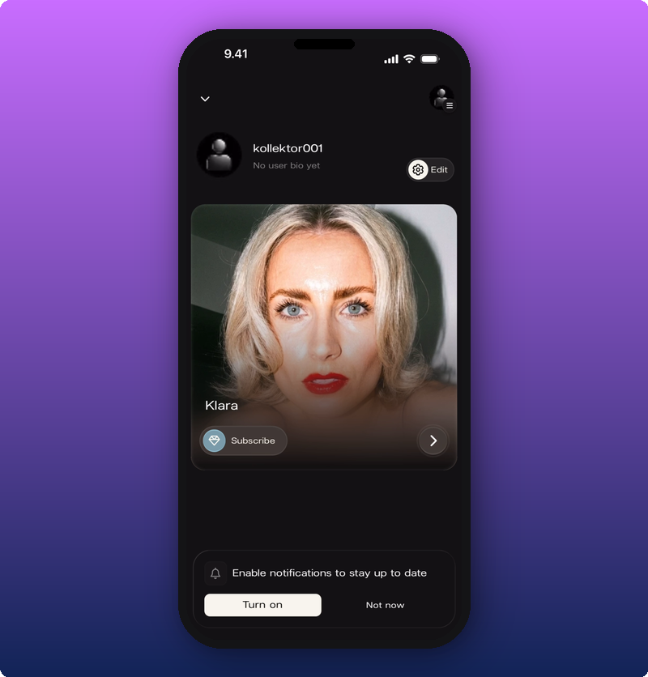
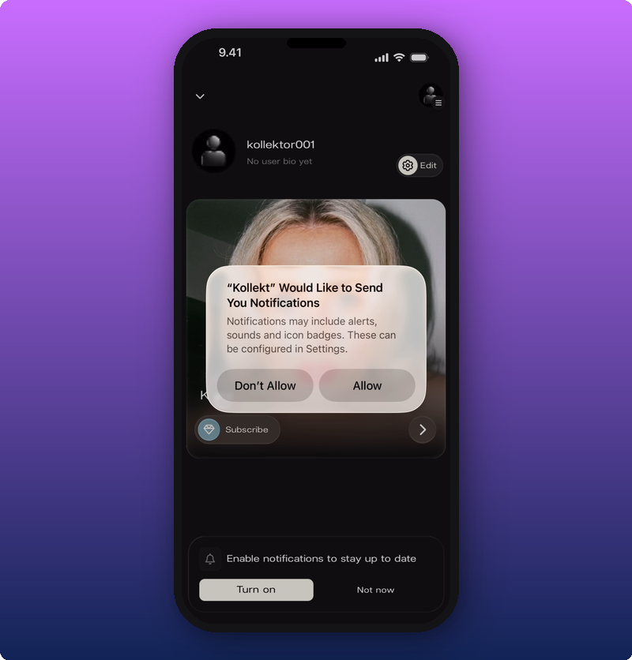

Push notifications are how you find out the artist posted, without having to open the app to check. Tour announcements, backstage photos, voice notes, presale codes, all of it lands on your phone the moment it goes out.

## The notification banner

The first time you land on your home screen after joining an artist, a banner appears at the bottom asking you to turn notifications on.

Tap **Turn on**. If you tap **Not now**, the banner goes away for this session and comes back next time.

## The system permission prompt

When you tap **Turn on**, your phone asks if Kollekt is allowed to send you notifications. This is your phone's permission, not Kollekt's.

Tap **Allow** to turn them on. Tap **Don't Allow** and Kollekt won't be able to ask again from inside the app. You'd have to turn them on later from your phone's Settings.

## If you want to change your mind later

If you said no by accident, you can fix it in your phone's Settings.

- **iPhone or iPad:** Settings, then Notifications, then Kollekt. Toggle **Allow Notifications** on.
- **Android:** Settings, then Notifications, then App notifications, then Kollekt. Turn it on.

## Related

- [Browsing the Direct Line](/for-fans/inside-the-space/browsing-direct-line). Direct Line posts trigger a push to every member.
- [Joining the chat](/for-fans/inside-the-space/participating-in-chat). Chat replies and reactions can trigger a push too.
- [Look around the artist's page](/for-fans/inside-the-space/exploring-the-artist-page). The fan home screen is where the banner shows up.
