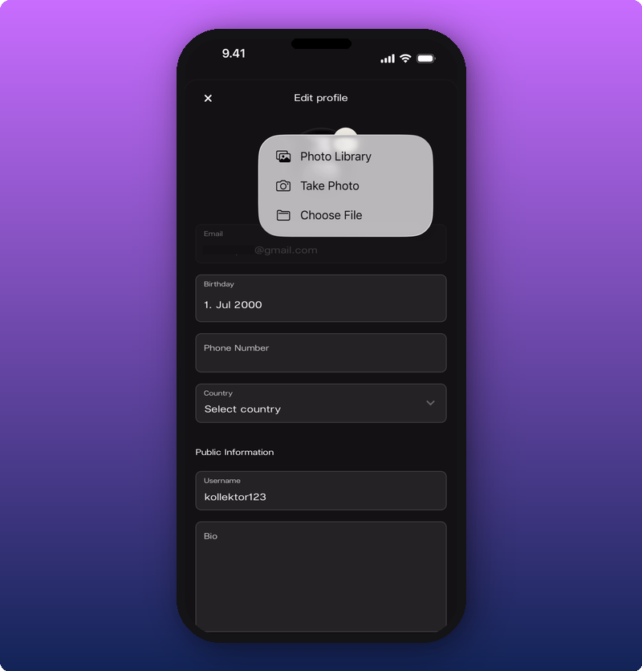
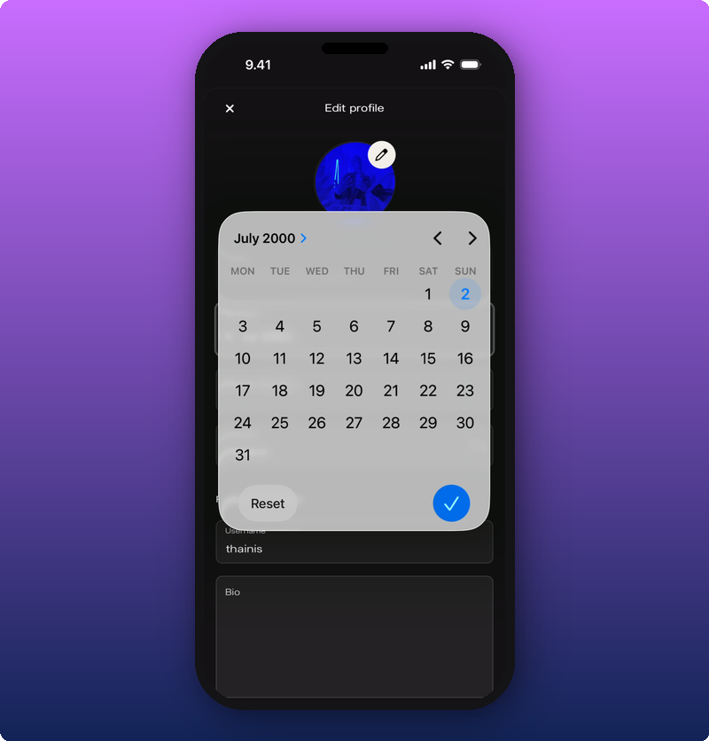
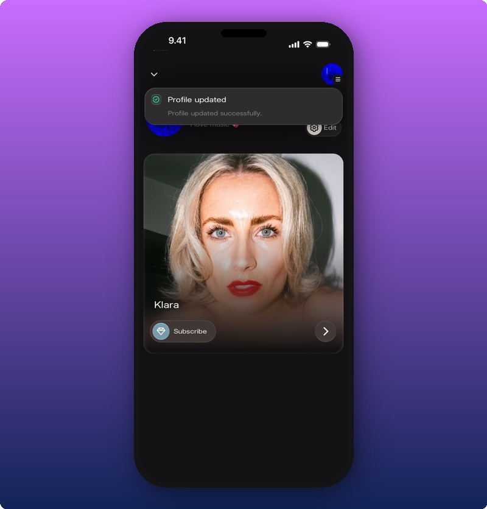

  <svg width="20" height="20" viewBox="0 0 24 24" fill="none" stroke="#c96dff" strokeWidth="2" strokeLinecap="round" strokeLinejoin="round" style={{flexShrink: 0, marginTop: "2px"}}>
    <path d="M9 18h6"/>
    <path d="M10 22h4"/>
    <path d="M15.09 14c.18-.98.65-1.74 1.41-2.5A4.65 4.65 0 0 0 18 8 6 6 0 0 0 6 8c0 1 .23 2.23 1.5 3.5A4.61 4.61 0 0 1 8.91 14"/>
  </svg>
  

    Are you an artist? Click <a href="/for-artists/your-account/edit-user-profile" style={{color: "#5a1d8c"}}>here</a>.
  

Your user profile is how you show up inside an artist's space. The name and photo you set here appear on your messages in chat, on your reactions, and on your profile card when another fan taps your name. When you first sign up, Kollekt gives you a placeholder name like "kollektor123". You can change that, your photo, and the rest any time.

## Open your profile

Tap the gear icon next to your profile on the fan home screen. The Edit profile page opens.

The page has two parts:

- **Private.** Email (you can't change this here), Birthday, Phone Number, Country.
- **Public Information.** Username and Bio. These are what other fans and artists see.

## Change your photo

Tap the pencil icon on the photo. A small menu pops up.

You have three options: pick a photo from your library, take a new one with the camera, or choose a file. Your new photo shows up straight away.

## Change your username

Tap the **Username** field under Public Information. Your keyboard opens.

Type the name you want. This is what fans see in chat.

## Add a bio

Tap the **Bio** field. Type something short about yourself, the music you love, or your favourite tour memory.

Your bio shows on your profile card, the one that pops up when another fan taps your name in chat.

## Add your phone number

Tap the **Phone Number** field. The number keyboard opens.

Type your number including the country code.

## Set your birthday

Tap the **Birthday** field. A calendar opens.

Pick the month, then the day. Tap the blue check to save.

## Pick your country

Tap the **Country** field. A list of countries opens.

Scroll or tap to pick yours.

## Save your changes

Scroll to the bottom of the form. Tap **Save**.

A green message appears on your fan home confirming the save.

If you change your mind, tap **Cancel** instead. Nothing gets saved.

## Want to delete your account?

If you want to leave Kollekt for good, you can do that from this same page. See [Delete your account](/for-fans/your-account/delete-your-account).

## Related

- [Joining an artist's space](/for-fans/getting-in/joining-an-artist). How to set up your account in the first place.
- [Get to know Kollekt](/for-fans/inside-kollekt/exploring-the-artist-page). Where the gear icon and your profile preview live.
- [Joining the chat](/for-fans/inside-kollekt/participating-in-chat). Where your name, photo, and bio show up to other fans.
- [Delete your account](/for-fans/your-account/delete-your-account). Leave Kollekt for good.
